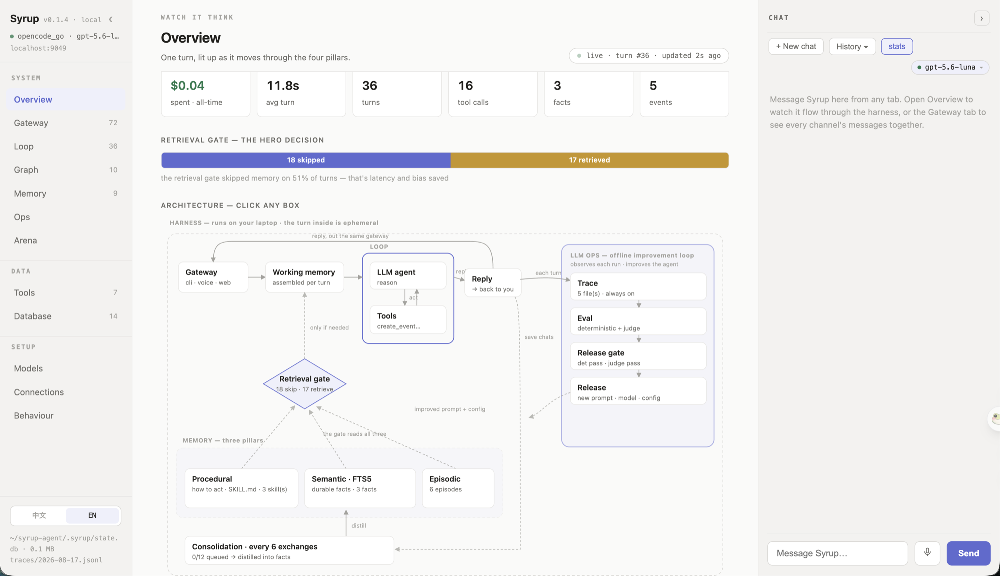

<p align="center">
  
</p>

**Syrup 是一个跑在你自己机器上的私人 AI 助手，也是一份小到一个下午就能读完的代码库。** 它帮你安排日程、记住你说过的话 —— 并且把这两件事是怎么做到的完整摊开给你看。凡是认真做的 agent，都由同样四个部分搭起来：Harness、Loop、Memory、Eval/LLM-Ops。这里每一部分都留在明处。

上面那张图不是为 README 画的。它就是 Dashboard 首页上那张实时架构图，数字来自一次真实运行：Retrieval gate 跳过了 18 次、检索了 17 次，Memory 里躺着 3 条事实、6 条情节、3 个 Skill。图里每一个方框，都是这个仓库里一个真实存在的目录。

---

## 快速开始

没有 PyPI 包，装法只有一种：clone 下来，可编辑安装。三条命令，可以整块粘贴 —— 里面没有行内注释，因为 zsh 在交互式粘贴时不把 `#` 当注释。

```bash
git clone https://github.com/nineofoursyrup/syrup-agent && cd syrup-agent
uv venv && uv pip install -e .
cp .env.example .env
```

打开 `.env`，选一个模型供应商，粘贴**一个** key。11 家可选 —— Anthropic（默认）、OpenAI、Gemini、DeepSeek、Kimi、GLM、MiniMax、xAI、OpenRouter、OpenCode Zen、OpenCode Go —— 设 `SYRUP_PROVIDER=`，粘 key，就够了。第一次运行时它会告诉你缺哪一个。

```bash
uv run syrup                  # 终端里的对话
uv run syrup dashboard        # 浏览器里的 Dashboard → http://localhost:9049
```

`uv run` 不必先激活虚拟环境；想少敲字就 `source .venv/bin/activate`，想装成全局命令就 `uv tool install .`。

## 最初的五分钟

按顺序说下面这几句 —— 终端里或 Dashboard 里都行。每一句都会让图上某一块当场亮起来。

| 你说这句 | 图上发生了什么 |
|---|---|
| *"记住 Alex 更喜欢上午开会。"* | 落进 **Semantic** —— `.syrup/state.db` 多了一行 |
| 退出、重启，再说 *"周五和 Alex 约个碰头。"* | 记忆挺过了重启，而且它会订在上午 |
| *"我今天日历上有什么？"* | **Tools** 读的是真存下来的日程，不是编的 |
| *"我什么时候见 Alex？"* 然后 *"12 乘 8 等于几？"* | **Retrieval gate**：一句检索，一句跳过 |
| *"搜一下世界杯还没打的比赛，每一场都加进我的日历。"* | **Loop** 转了大约八圈：搜、推理、创建，反复 |

最后那句是压轴。一轮对话里它会搜几次网、对结果做推理、给每一场比赛建一个日程，全程在 Dashboard 上可见。不配 key 也能跑（走 DuckDuckGo），但那个免费接口会限流机器人 —— 想录一段干净的演示，配一个免费的 `TAVILY_API_KEY`。

## 架构图里每个框对应的代码

| 架构图上的框 | 代码 |
|---|---|
| Gateway | [`syrup/gateway/`](syrup/gateway) —— 终端、语音、五个聊天软件，每个一个文件 |
| Working memory | [`syrup/runtime/session.py`](syrup/runtime/session.py) |
| Loop · LLM agent · Tools | [`syrup/loop/agent.py`](syrup/loop/agent.py) 的 `run_loop`，约 95 行 · [`syrup/tools/`](syrup/tools) |
| Retrieval gate | [`syrup/memory/retrieval_gate.py`](syrup/memory/retrieval_gate.py)，55 行 |
| Semantic / Episodic / Procedural | [`syrup/memory/`](syrup/memory) |
| Consolidation | [`syrup/memory/consolidation.py`](syrup/memory/consolidation.py) |
| Trace / Release gate | [`syrup/ops/tracing.py`](syrup/ops/tracing.py) · [`syrup/ops/release_gate.py`](syrup/ops/release_gate.py) |
| Eval：deterministic vs judge | [`evals/deterministic/`](evals/deterministic) vs [`evals/judge/`](evals/judge) |

Loop 是一段可以挂调试器单步走完的纯 Python：模型要工具就执行、把结果递回去、再问一次；它不再要工具就自然结束，或者撞上 `max_iterations` 硬停 —— 永远不会无限转下去。

---

## Memory —— 大多数 agent 做错的那一块

Memory 分三种，因为它们回答的是三个不同的问题：

| 种类 | 回答什么 | 例子 |
|---|---|---|
| **Semantic** | 什么是真的？ | "Alex 更喜欢上午开会" |
| **Episodic** | 发生过什么？ | "周二我们约了周六去游泳" |
| **Procedural** | 这件事该怎么做？ | 一份写着你每周复盘流程的 `SKILL.md` |

另外两个部件，让这个存储保持「有用」，而不只是「变大」：

**Retrieval gate。** 大多数 agent 每一轮都把自己的记忆翻一遍。这不只是慢 —— 更糟的是不相关的记忆会把答案带偏。所以先让一个便宜的小模型回答一个窄问题：*这条消息到底需不需要记忆？*

```
you > 12 乘 8 等于几?
  gate · skip — 纯计算
you > 我什么时候见 Alex?
  gate · retrieve — 提到了你的安排
```

**Consolidation。** 每 6 轮对话（`SYRUP_CONSOLIDATE_EVERY`），一道流程回头读原始对话，把值得留下的沉淀成持久的事实。聊天很廉价，事实才是目的。

**`state.db` 和 `MEMORY.md`，两个都要。** 有些助手把长期记忆做成一个 markdown 文件。这里**可查询的源头**是 `state.db`（SQLite FTS5 关键词检索），同时每一轮之后重新生成一份人类可读的 `.syrup/MEMORY.md` 镜像 —— 你既有一个能直接打开的文件，背后又有一个真正的数据库。它还自己管自己的记忆，用的是你能看着它调用的工具：`manage_memory` 改正或忘掉一条事实、`update_soul` 记下长期偏好、`create_skill` 把你教会它的流程存成 Skill —— 这些在 Dashboard 的 Memory 页里也能手改。

## Graph —— 当一轮对话需要「形状」

Loop 是一条直路，应付聊天够用。但有些活儿是有**形状**的：有些步骤本可以同时跑，有些地方需要显式的「如果这样，就走那边」。

<p align="center">
  
</p>

**已经跑起来的例子是 Triage。** 设 `SYRUP_GRAPH_WORKFLOWS=1`，之后每条消息都先进这张 graph —— 你永远不用自己选模式，这张 graph 本身就是那个选择。*"谢谢！"* 由小模型答完就走，大模型根本不会醒； *"周六安排个游泳"* 路由进和以前一模一样的那个 Loop，只不过这次它是 graph 里的一个节点。

任何一个环节出问题 —— 分类器、引擎、随便什么 —— 都**回退**到普通 Loop，所以这个开关只可能替你省时间省 token，不会弄丢一次回复。引擎是[一个 206 行的文件](syrup/graph/engine.py)，走哪条边完全由确定性规则决定 —— 这里的 Graph 不是一群互相聊天的 agent，也正因如此它才能被追踪、被评测。

## 看着它跑 —— Dashboard

```bash
uv run syrup dashboard        # 一个本地服务 → http://localhost:9049
```



`127.0.0.1`，不上云。浏览器只是界面，跑这一轮的还是同一个进程 —— 这是理解整个系统最快的方式。每一页都挂着聊天面板：打字或者说话，然后看着消息在架构图上流动，Retrieval gate 亮起、Tools 被调用、Memory 更新。前端是纯静态文件，没有构建步骤。界面语言中英可切（左下角）。

页面顶上那张图，就是本文开头那张 —— 它不是插画，是这个页面的一部分，每个方框都能点开。左下角那行 `state.db · 0.1 MB` 是重点：整个助手记住的东西，就是这一个你可以自己打开的文件。

| 分组 | 页面 |
|---|---|
| **System** | Overview（成本、延迟、Retrieval gate 比例，和那张可点的架构图）· Gateway · Loop · Graph · Memory · Ops · Arena（同样的任务，换不同的模型跑） |
| **Data** | Tools（按来源分组，含 MCP）· Database（实时 SQLite 浏览器，含只读 SQL 控制台） |
| **Setup** | Models · Connections · Behaviour |

## Eval 与 Trace —— 拿证据，不拿感觉

两种 Eval，刻意分开：

```bash
make eval          # deterministic：「该调的工具调了吗？」—— 0 或 1，没有模型来打分。728 个用例
make eval-judge    # judge：「这个回复好不好？」—— 一个分数，需要 key
make gate          # release gate：deterministic 必须全过，judge 分必须过阈值
```

把「它有没有做成这件事」和「它做得好不好」混为一谈，是 agent eval 里最常见的错误。前者是单元测试，后者是带阈值的判断。在这里，它们是你可以分别对比的两套东西。

**撞到 bug 就这么做**：修它，**并且**补一条 deterministic eval，让它再也回不来。仓库里的真实例子 —— Triage 曾把一句孤零零的「是」判成客套话，路由去 quick_reply，于是一个已经确认的预订静悄悄地没有发生；修在 `classify_message` 带上上一轮问题，锁在 [`test_triage_workflow.py`](evals/deterministic/test_triage_workflow.py) 里。

**Trace 一直开着。** 每一轮都往 `.syrup/traces/<date>.jsonl` 追加可读的行。想要瀑布图式的 span 视图：

```bash
uv pip install -e '.[tracing]'
make trace                    # Phoenix → localhost:6006
OTEL_EXPORTER_OTLP_ENDPOINT=http://localhost:4317 make run
```

**花费是永久记录的。** 每次模型调用的 token 追加进 `.syrup/usage.jsonl`，一个只增不改的账本，演示用的重置脚本也抹不掉它。金额由 token 估算，token 才是事实来源。

---

## 所有命令

`syrup` 命令随包一起安装；`make` 目标是等价的别名。

| 命令 | 做什么 |
|---|---|
| `syrup` | 在终端里聊天 |
| `syrup dashboard` | localhost:9049 上的 Dashboard（设了 `TELEGRAM_BOT_TOKEN` 会一并启动 Telegram） |
| `syrup connections` | 列出已配置的集成和它们的健康状态 |
| `syrup voice` | 跟它说话 —— 免提唤醒词，或按键说话 |
| `syrup telegram` | 用手机给它发消息 |
| `syrup discord` | 同上，从 Discord |
| `syrup whatsapp` | 同上，从 WhatsApp（需要公网地址） |
| `syrup dingtalk` | 同上，从钉钉 |
| `syrup feishu` | 同上，从飞书 |
| `syrup brief` | 用日历、邮件和记忆生成晨间简报 —— 以 Loop 的方式 |
| `syrup gather` | 同一件事以 Graph 的方式做：四个来源并行取回，再汇成一份摘要 |
| `syrup skill install <url>` | 安装一个社区 Skill |
| `make trace` · `make eval` · `make eval-judge` · `make gate` | Trace 瀑布图 · deterministic eval · judge eval · Release gate |

## 更多用法

<details>
<summary><b>跟它说话</b> —— 唤醒词，或者按键说话</summary>

`uv pip install -e '.[voice]'` 之后 `syrup voice`。默认免提：一个很小的 Whisper 模型盯着麦克风听唤醒词 **"susususu syrupnova"**，听到之后由大模型接管，并把回复念出来。匹配逻辑是一个短小的纯函数，有自己的测试。

```bash
SYRUP_WAKE_WORD="hey syrup"  syrup voice   # 换成任意短语，无需训练
SYRUP_WAKE_WORD=""           syrup voice   # 改成按键说话（回车、说话、回车）
```

朗读默认走 macOS `say`；想要完全本地的神经网络音色就装 [Kokoro](https://github.com/hexgrad/kokoro)（`.[voice-neural]`，会拉约 2GB 的 torch）。两种引擎都能用 `SYRUP_VOICE` 覆盖。
</details>

<details>
<summary><b>用手机跟它聊</b> —— Telegram、Discord、WhatsApp、钉钉、飞书</summary>

`uv pip install -e '.[telegram]'`，找 @BotFather 发 `/newbot`，token 放进 `.env`，然后 `make telegram`。

在任何地方给你的 bot 发消息，跑这一轮的还是你自己的笔记本 —— 走长轮询，不需要公网地址或 webhook。`TELEGRAM_ALLOWED_USER` 可以锁定成只有你能用。另外四个 Gateway 是同一个形状：一个文件，文本进，文本出。
</details>

<details>
<summary><b>真实的日历和邮件</b> —— 晨间简报，或者同步到 Google 日历</summary>

```bash
SYRUP_APPLE_TOOLS=1 make brief      # macOS；第一次要点同意几个权限弹窗
30 7 * * *  cd ~/syrup-agent && make brief    # 放进 crontab，让它每天早上问候你
```

它会读你真实的日历（包括别人用邮件邀请你的日程）和最近的 Apple Mail，跟记忆交叉比对，写出一份重点优先的简报，附可点击的 `message://` 链接。走的是同一套系统，所以它在 Dashboard 上的动画和普通一轮对话没有区别。

本地数据库和 `calendar.ics` 始终是权威来源。想把 `create_event` 的结果也写进 Google 日历，`.[gcal]` + `SYRUP_GOOGLE_CALENDAR=1` —— 凭据交给 `gcloud` 存在 `~/.config/gcloud/`，不进仓库，Google 那边失败也不回滚本地日程。macOS 上换 Apple 日历是 `SYRUP_APPLE_CALENDAR=1`，工具 schema 不变。
</details>

<details>
<summary><b>接 MCP 服务</b>，或者<b>加 Skill</b></summary>

`uv pip install -e '.[mcp]'`，创建 `.syrup/mcp.json`，任何 Model Context Protocol 服务的工具都会出现在 agent 面前，命名空间是 `<server>_<tool>`：

```json
{"servers": [{"name": "fs", "command": "npx",
  "args": ["-y", "@modelcontextprotocol/server-filesystem", "/tmp"]}]}
```

仓库里自带一个很小的纯 Python MCP 服务，不装 Node 也能试：`cp examples/mcp.demo.json .syrup/mcp.json`，然后在 Tools 页里找 `demo_word_count`。

Skill 就是 procedural memory：只在相关时才被加载的 markdown 说明书，写一个完全不需要 Python —— 把 [`skills/TEMPLATE.md`](skills/TEMPLATE.md) 复制进 [`skills/community/`](skills/community) 即可，CI 会校验 frontmatter。装别人的：`syrup skill install <SKILL.md 的 URL>`。
</details>

<details>
<summary><b>把写代码的活派出去</b>，以及<b>当默认配置不够用时</b></summary>

`delegate_task` 把一个编码任务交给 [pi](https://github.com/earendil-works/pi) —— 一个极简的开源编码 agent，走它的无界面模式。Syrup 仍然是指挥者（Memory、上下文、Eval），pi 是那个专业外包工。需要 `SYRUP_EXPERIMENTAL=1`，完整对话记录落在 `.syrup/outbox/delegate-*.log`。同一个开关下还有几个**故意留成骨架**的工具（[`experimental.py`](syrup/tools/experimental.py)）：`run_command` 等一个真正的沙箱，`browse_web`、`schedule_task` 意图写明但不做过度承诺。

| 默认（零配置） | 升级为 | 怎么做 |
|---|---|---|
| SQLite FTS5 关键词记忆 | Supabase pgvector 语义检索 | `SYRUP_SEMANTIC_STORE=supabase` + [sql/init_supabase.sql](sql/init_supabase.sql) |
| 模拟日历（ICS + SQLite） | Apple / Google 日历 | `SYRUP_APPLE_CALENDAR=1` 或 `SYRUP_GOOGLE_CALENDAR=1` |
| 手写的三根 Memory 支柱 | mem0 / Letta / Zep | 把这个仓库教的东西自动化掉的生产级框架 |
</details>