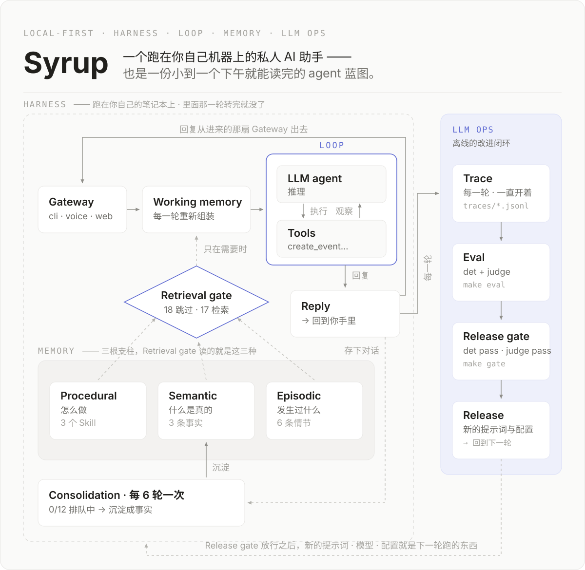
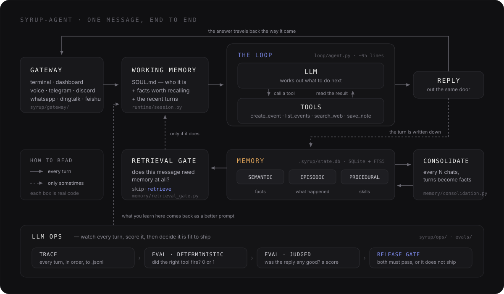
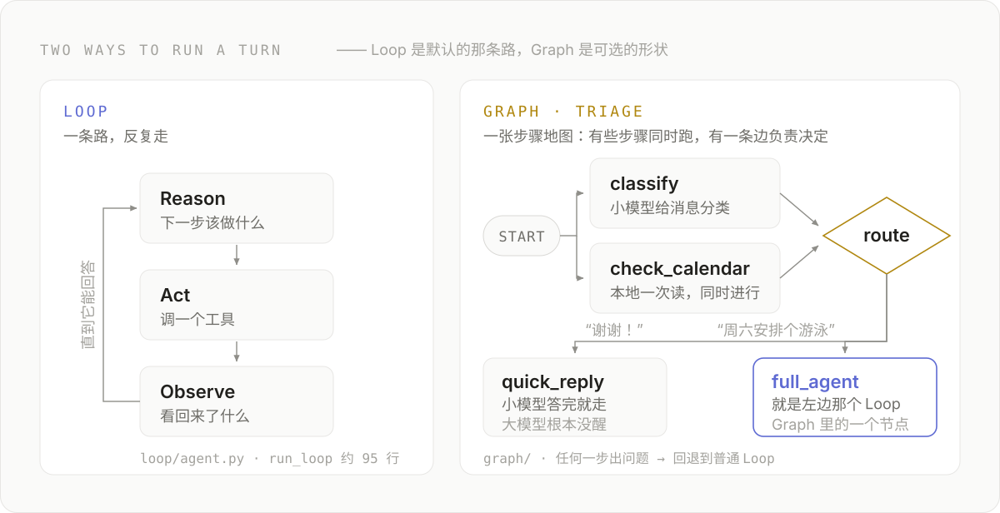

<p align="center">
  
</p>

**Syrup 是一个跑在你自己机器上的私人 AI 助手 —— 同时也是一份小到一个下午就能读完的代码库。**
它能帮你安排日程、记住你说过的话，并且把这两件事是怎么做到的完整展示给你看。没有任何东西藏在框架背后。

但凡认真做的 Agent，都由同样的四个部分搭起来。Syrup 让每一部分都留在明处：

| 支柱 | 它是什么 | 代码在哪 |
|---|---|---|
| **Harness（外壳）** | 人跟它说话的那些门，以及门后的管道 | [`syrup/gateway/`](syrup/gateway) |
| **Loop（循环）** | 思考、调工具、看结果、再来一遍 | [`syrup/loop/agent.py`](syrup/loop/agent.py) |
| **Memory（记忆）** | 它知道什么、发生过什么、会做什么 | [`syrup/memory/`](syrup/memory) |
| **Eval / LLM-Ops（评测与运维）** | 上线之前，证明它还能用 | [`evals/`](evals) + [`syrup/ops/`](syrup/ops) |

- **本地优先。** 你的记忆就是一个 SQLite 文件。打开它、读它，它是你的。
- **记忆是主角。** 事实、事件、技能三类记忆，外加一道闸门决定「要不要检索」、一道流程决定「留下什么」。
- **循环就是约 95 行纯 Python**，可以直接挂上调试器单步走完。
- **看着它思考。** 本地仪表盘会把每一条消息在系统里流动的过程点亮。
- **评测是内置的。** 确定性测试和 LLM 裁判打分并排跑，由一道发布闸门守在上线之前。

---

## 快速开始

三条命令。可以整块粘贴 —— 里面没有行内注释，因为 zsh 在交互式粘贴时不会把 `#` 当注释。

```bash
git clone https://github.com/nineofoursyrup/syrup-agent && cd syrup-agent
uv venv && uv pip install -e .
cp .env.example .env
```

这会创建虚拟环境、安装 `syrup` 命令，并生成一份待填的配置文件。打开 `.env`，选一个模型供应商，
粘贴**一个** key —— 第一次运行时它会告诉你该填哪一个。然后：

```bash
uv run syrup
```

这就是终端里的对话。想要浏览器上的驾驶舱，就换一条命令：

```bash
uv run syrup dashboard        # http://localhost:9049
```

`uv run syrup …` 不需要事先激活虚拟环境。三种用法任选：

| 命令 | 什么时候用 |
|---|---|
| `uv run syrup dashboard` | 启动最快，什么都不用激活（推荐） |
| `source .venv/bin/activate` 之后 `syrup dashboard` | 激活一次，整个会话都能直接敲 `syrup` |
| `uv tool install .` 之后 `syrup dashboard` | 把 `syrup` 装成全局命令，一劳永逸 |

**用你已经在付费的那个模型。** Anthropic（默认）、OpenAI、Gemini、DeepSeek、MiniMax、Kimi、
GLM、xAI、OpenRouter（一个 key，几百个托管模型）、OpenCode Zen、OpenCode Go —— 设置
`SYRUP_PROVIDER=`，粘贴 key，就好了。循环内部只说一种方言，其余方言交给
[一层薄适配](syrup/loop/models.py) 翻译。

---

## 最初的五分钟

按顺序在终端对话或仪表盘里说下面这几句，每一句都会让某一根支柱当场干活。

| 你说这句 | 你刚刚看到了什么 |
|---|---|
| *"记住 Alex 更喜欢上午开会。"* | 它存下了一条事实 —— `.syrup/state.db` 多了一行 |
| 退出、重启，然后 *"周五和 Alex 约个碰头。"* | 记忆挺过了重启，而且它会订在上午 9 点 |
| *"我今天日历上有什么？"* | 它读的是真实存下来的日程，而不是编一个出来 |
| *"我什么时候见 Alex？"* 然后 *"12 乘 8 等于几？"* | 检索闸门：一句需要记忆，另一句显然不需要 |
| *"搜一下世界杯还没打的比赛，每一场都加进我的日历。"* | 循环把工具串起来 —— 搜索、推理、创建，反复多轮 |

最后那条是压轴。在一轮对话里，Syrup 会搜几次网、对结果做推理、给每一场比赛建一个日程 ——
大约八次循环迭代，全程可见。不配 key 也能跑（走 DuckDuckGo），但那个免费接口会限流机器人；
想录一段干净的演示，就配一个免费的 `TAVILY_API_KEY`。

---

## 它是怎么工作的

先看一张图，再用文字讲一遍同一件事。图里每一个方框，都是这个仓库里真实存在的一个目录。



**消息从一个网关进来** —— 终端、仪表盘、你的声音，或者某个聊天软件。网关只负责搬运文本，
本身不做任何决定。

**为这一轮组装工作记忆**：`SOUL.md`（Syrup 是谁）、值得被想起的事实，以及最近的对话。

**循环开始跑。** 模型看完消息，要么直接回答，要么要求调用一个工具。如果它要工具，Syrup 就执行、
把结果递回去、再问一次。两件事会结束一轮：模型不再要工具（自然结束），或者撞上
`max_iterations`（硬停 —— 它永远不会无限转下去）。

```
while not done:
    response = llm(messages, tools)      # 思考
    if response wants tools:
        results = run(tool_calls)        # 行动
        messages += results              # 观察
    else:
        done                             # 回复人类
```

**回复从它进来的那扇门回去**，同时这一轮被记录下来：写进记忆、写进 trace 文件、写进花费账本。

### 每个方框对应的代码

| 图里的方框 | 代码 |
|---|---|
| 网关（终端、仪表盘、语音、聊天软件） | [`syrup/gateway/`](syrup/gateway) |
| 工作记忆 | [`syrup/runtime/session.py`](syrup/runtime/session.py) |
| 循环 | [`syrup/loop/agent.py`](syrup/loop/agent.py) |
| 工具 | [`syrup/tools/`](syrup/tools) |
| 记忆存储（`state.db`） | [`syrup/memory/`](syrup/memory) |
| 检索闸门 | [`syrup/memory/retrieval_gate.py`](syrup/memory/retrieval_gate.py) |
| 记忆整理 | [`syrup/memory/consolidation.py`](syrup/memory/consolidation.py) |
| 图工作流 | [`syrup/graph/`](syrup/graph) |
| 链路追踪 | [`syrup/ops/tracing.py`](syrup/ops/tracing.py) |
| 评测：确定性 vs 裁判 | [`evals/deterministic/`](evals/deterministic) vs [`evals/judge/`](evals/judge) |
| 发布闸门 | [`syrup/ops/release_gate.py`](syrup/ops/release_gate.py) |

---

## 记忆 —— 大多数 Agent 做错的那一块

Syrup 保留三种记忆，因为它们回答的是三个不同的问题：

| 种类 | 回答什么 | 例子 |
|---|---|---|
| **语义记忆** | 什么是真的？ | "Alex 更喜欢上午开会" |
| **情节记忆** | 发生过什么？ | "周二我们约了周六去游泳" |
| **程序记忆** | 这件事该怎么做？ | 一份描述你每周复盘流程的 `SKILL.md` |

另有两个部件，让这个存储保持「有用」而不只是「变大」：

**检索闸门** —— 大多数 Agent 每一轮都去把自己的记忆翻一遍。这不只是慢，更糟的是：不相关的记忆
会把答案带偏。所以这里先让一个便宜的小模型回答一个问题 —— *这条消息到底需不需要记忆？*

```
you > what's 2+2?
  gate · skip — pure math
you > when am I meeting Alex?
  gate · retrieve — references user's plans
```

**记忆整理** —— 每隔 N 轮对话，一道流程会回头读原始对话，把值得留下的东西沉淀成持久的事实。
聊天很廉价，事实才是目的。

**`MEMORY.md` 和 `state.db`，两个都要。** 有些助手把长期记忆做成一个 markdown 文件。Syrup 把
**可查询的源头**放在 `state.db`（用 SQLite FTS5 做关键词检索），**并且**在每一轮之后重新生成一份
人类可读的 `.syrup/MEMORY.md` 镜像 —— 你既有一个能直接打开的文件，背后又有一个真正的数据库。

**它会管理自己的记忆**，用的是你能看着它调用的工具：

- `manage_memory` —— 你说某条事实错了，它就改正或忘掉
- `update_soul` —— 记下你给的长期偏好（存在 `SOUL.md` 里）
- `create_skill` —— 你教会它一套可重复的流程时，它会主动提出把它存成一个技能

这些内容你也可以在仪表盘的 Memory 标签页里手动编辑。

---

## 图工作流 —— 当一轮对话需要「形状」

循环是一条直路：思考、行动、观察、重复。应付聊天，这就够了。但有些活儿是有**形状**的 ——
有些步骤本可以同时跑，有些地方需要显式的「如果这样，就走那边」。图工作流把这个形状变成一等公民，
而且完全不动循环本身。



**已经跑起来的例子是 triage（分诊）。** 设置 `SYRUP_GRAPH_WORKFLOWS=1`，之后每条消息都先进分诊图 ——
你永远不用自己选模式，系统来决定。一个小模型负责给消息分类，同时今天的日历并行加载完成。
*"谢谢！"* 会得到小模型的快速回复，大模型根本不会被唤醒；*"周六安排个游泳"* 则路由进和以前
一模一样的那个循环，只不过这次它是图里的一个节点。

任何一个环节出问题 —— 分类器、引擎、随便什么 —— 都会**回退**到普通循环。所以这个开关只可能替你
省时间省 token，永远不会弄丢一次回复。

整个引擎就是[一个能一口气读完的文件](syrup/graph/engine.py)。这里的「图」不是一群互相聊天的
Agent —— 走哪条边完全由确定性规则决定，也正因如此，它才能像系统的其余部分一样被追踪、被评测。

---

## 看着它跑 —— 仪表盘

```bash
syrup dashboard          # 一个本地服务 → http://localhost:9049
```

一个属于你自己的小 web 服务（`127.0.0.1`，不上云）。浏览器只是界面，跑这一轮的还是同一个进程。
这是理解整个系统最快的方式。

每个标签页上都挂着一个聊天面板。打字或者说话，然后看着消息在架构图上流动：闸门亮起、循环调用工具、
回复返回、记忆更新。前端是纯静态文件，没有构建步骤。

| 标签页 | 你能看到什么 |
|---|---|
| **Overview** | 成本、延迟、闸门 skip/retrieve 的比例，以及一张可点击的架构图 |
| **Gateway** | 跨所有渠道的同一条对话，每条消息都标注来自哪里 |
| **Loop** | 每一轮的闸门决定、工具调用、迭代次数、token 和花费 |
| **Graph** | 由引擎自己画出来的分诊拓扑，以及每一轮走了哪条路 |
| **Memory** | 每种记忆一个子标签 —— 事实、情节、可编辑的技能与 `SOUL.md`、记忆整理 |
| **Tools** | 按来源分组的工具、它们的执行结果，以及 MCP 连接器 |
| **Data** | 一个实时 SQLite 浏览器：分表标签、表结构，还有只读 SQL 控制台 |
| **Ops** | 评测结论与历史、闸门决定、最慢的那些轮次、内联的原始 trace |

---

## 评测与追踪 —— 拿证据，不拿感觉

两种评测，刻意分开：

```bash
make eval          # 确定性测试："该调的工具调了吗？" —— 0 或 1，没有模型来打分
make eval-judge    # LLM 裁判："这个回复好不好？" —— 一个分数，需要 key
make gate          # 发布闸门：确定性必须 100% 通过，裁判分必须过阈值
```

把「它有没有做成这件事」和「它做得好不好」混为一谈，是 Agent 评测里最常见的错误。前者是单元测试，
后者是带阈值的判断。在这里，它们是你可以分别对比的两套测试。

**捉 bug 的工作流。** 当你在真实使用中撞到一个 bug，你要修它 **并且** 补一条确定性测试，让它再也回不来。
这个仓库里的真实例子：Agent 不知道当前时间，在安排「30 分钟后」之前先来问你 —— 修在
[`session.py`](syrup/runtime/session.py)，被
[`test_working_memory.py`](evals/deterministic/test_working_memory.py) 永久锁住。

**追踪一直开着。** 每一轮都会往 `.syrup/traces/<date>.jsonl` 追加可读的行 ——
所谓 trace，就是「按顺序发生了什么」。想要瀑布图式的 span 视图：

```bash
pip install -e '.[tracing]'
make trace                                            # Phoenix，localhost:6006
OTEL_EXPORTER_OTLP_ENDPOINT=http://localhost:4317 make run
```

Langfuse 云端认的是同一个 OpenTelemetry 开关。

**花费是永久记录的。** 每次模型调用的 token 都会追加进 `.syrup/usage.jsonl`，一个只增不改的账本，
演示用的重置脚本也不会抹掉它。Ops 标签页显示历史总花费，以及按天、按供应商的明细 ——
金额是由 token 估算的，token 才是事实来源。

---

## 让它成为你的

<details>
<summary><b>跟它说话</b> —— 唤醒词，或者按键说话</summary>

```bash
uv pip install -e '.[voice]'
syrup voice
```

默认免提：一个很小的 Whisper 模型盯着麦克风听唤醒词 **"susususu syrupnova"**，
听到之后由大模型接管你的指令，并把回复念出来。

```bash
SYRUP_WAKE_WORD="hey syrup"  syrup voice     # 换成任意短语，无需训练
SYRUP_WAKE_WORD=""           syrup voice     # 改成按键说话（回车、说话、回车）
```

匹配逻辑是一个短小的纯函数，透明可读，并配有自己的测试。开箱即用时由 macOS `say` 朗读（Syrup 会自动挑你装过的
最好的那个音色）；想要完全本地的神经网络音色，装 [Kokoro](https://github.com/hexgrad/kokoro)：

```bash
uv pip install '.[voice-neural]'          # 会拉 torch（约 2GB）
```

两种引擎都可以用 `SYRUP_VOICE` 覆盖。
</details>

<details>
<summary><b>用手机跟它聊</b> —— Telegram、Discord、WhatsApp、钉钉、飞书</summary>

```bash
pip install -e '.[telegram]'
# 找 @BotFather 发 /newbot，把 token 放进 .env，然后：
make telegram
```

在任何地方给你的 bot 发消息，跑这一轮的是你自己的笔记本 —— 走长轮询，不需要公网地址或 webhook。
设置 `TELEGRAM_ALLOWED_USER` 可以锁定成只有你能用。另外四个网关是同一个形状：一个文件，文本进，文本出。
</details>

<details>
<summary><b>帮我梳理这一周</b> —— 真实的 Apple 日历和邮件</summary>

```bash
SYRUP_APPLE_TOOLS=1 make brief      # macOS；第一次要点同意几个权限弹窗
```

Syrup 会读你真实的日历（包括别人用邮件邀请你的日程）和最近的 Apple Mail，跟你的记忆交叉比对，
写出一份以「重点优先」组织的简报，附带可点击的 `message://` 链接。用 cron 让它每天早上问候你：

```
30 7 * * *  cd ~/syrup-agent && make brief
```

它走的是同一套系统，所以在仪表盘上的动画跟任何一轮普通对话没有区别。
</details>

<details>
<summary><b>把日程同步到 Google 日历</b></summary>

本地数据库和 `calendar.ics` 仍然是权威来源。如果还想把 `create_event` 的结果写进 Google 日历：

```bash
pip install -e '.[gcal]'
# 下载下来的 client 文件请放在仓库之外 —— 它只是 gcloud 的输入，
# gcloud 会把换来的凭据存进 ~/.config/gcloud/。
gcloud auth application-default login \
  --client-id-file=~/.config/syrup/gcal-client.json \
  --scopes=https://www.googleapis.com/auth/calendar.events
SYRUP_GOOGLE_CALENDAR=1 syrup
```

任何机密都不需要放进仓库。默认目标是登录用户的 `primary` 日历，换一个就设
`SYRUP_GOOGLE_CALENDAR_ID`。Google 那边失败不会回滚本地日程，也不会给参与者发通知。
</details>

<details>
<summary><b>接入 MCP 服务</b></summary>

```bash
pip install -e '.[mcp]'
```

创建 `.syrup/mcp.json`，任何 Model Context Protocol 服务的工具都会出现在 Agent 面前，
命名空间为 `<server>_<tool>`：

```json
{"servers": [{"name": "fs", "command": "npx",
  "args": ["-y", "@modelcontextprotocol/server-filesystem", "/tmp"]}]}
```

仓库里自带一个很小的纯 Python MCP 服务，不装 Node 也能试：

```bash
cp examples/mcp.demo.json .syrup/mcp.json   # 指向 examples/mcp_demo_server.py
make dashboard                               # Tools 里会出现 demo_word_count / demo_reverse_text
```
</details>

<details>
<summary><b>加技能</b> —— 你自己的，或者社区的</summary>

技能就是程序记忆：只在相关时才被加载的 markdown 说明书。

```bash
syrup skill install https://github.com/<someone>/<repo>/blob/main/skills/<skill>/SKILL.md
```

写一个技能完全不需要 Python。把 [`skills/TEMPLATE.md`](skills/TEMPLATE.md) 复制到
[`skills/community/`](skills/community) 即可，CI 会校验 frontmatter。
</details>

<details>
<summary><b>把写代码的活派出去</b> —— 子 Agent，已经可用</summary>

`delegate_task` 会把一个编码任务交给 [pi](https://github.com/earendil-works/pi) ——
一个极简的开源编码 Agent，走它的无界面模式。Syrup 仍然是指挥者（记忆、上下文、评测），
pi 是那个专业的外包工（读、执行、改、写）。

```bash
npm install -g --ignore-scripts @earendil-works/pi-coding-agent
SYRUP_EXPERIMENTAL=1 uv run syrup
# "让 pi 修一下 ~/my-project 里那个挂掉的测试"
```

pi 的完整对话记录会落在 `.syrup/outbox/delegate-*.log`，超时预算用 `SYRUP_DELEGATE_TIMEOUT`
调整（默认 300 秒）。
</details>

---

## 所有命令

`syrup` 命令随包一起安装；`make` 目标是等价的别名。

| 命令                          | 做什么                                                             |
| --------------------------- | --------------------------------------------------------------- |
| `syrup`                     | 在终端里聊天                                                          |
| `syrup dashboard`           | localhost:9049 上的实时驾驶舱（若设了 `TELEGRAM_BOT_TOKEN` 会一并启动 Telegram） |
| `syrup connections`         | 列出已配置的集成和它们的健康状态                                                |
| `syrup voice`               | 跟它说话 —— 免提唤醒词，或按键说话                                             |
| `syrup telegram`            | 用手机给它发消息（独立运行）                                                  |
| `syrup discord`             | 同上，从 Discord（需要 `DISCORD_BOT_TOKEN`）                            |
| `syrup whatsapp`            | 同上，从 WhatsApp（需要 `WHATSAPP_TOKEN` 和公网地址）                        |
| `syrup dingtalk`            | 同上，从钉钉（需要 `DINGTALK_CLIENT_ID` / `DINGTALK_CLIENT_SECRET`）      |
| `syrup feishu`              | 同上，从飞书（需要 `FEISHU_APP_ID` / `FEISHU_APP_SECRET`）                |
| `syrup brief`               | 用日历、邮件和记忆生成晨间简报 —— 以 LOOP 的方式                                   |
| `syrup gather`              | 同一件事以 GRAPH 的方式做：github、网页、日历、记忆并行取回，再汇成一份摘要                    |
| `syrup skill install <url>` | 安装一个社区技能                                                        |
| `make trace`                | localhost:6006 上的深度追踪瀑布图（Phoenix）                               |
| `make eval`                 | 确定性评测（0/1，无裁判）                                                  |
| `make eval-judge`           | LLM 裁判评测（打分）                                                    |
| `make gate`                 | 发布闸门 —— 两套测试都必须通过                                               |

---

## 这和 ChatGPT、Claude Desktop 有什么不同？

那些是你**用**的产品。这是一份你**拥有**的代码库 —— 循环、记忆表结构、闸门、评测框架，
全都能读能改。读懂这个仓库，你就懂了那些产品在底下到底在干什么。

跟那些大型开源助手比呢？架构是同一套，代码量只有百分之一 —— 那边是产品，这边是一份你真读得
下去的蓝图。

---

## 路线图

这些都在 [`syrup/tools/experimental.py`](syrup/tools/experimental.py) 里，默认关闭 ——
`SYRUP_EXPERIMENTAL=1` 才会注册。骨架是故意留成骨架的：意图已经写明，架构图上的每个框都能对上
真实代码，但绝不做过度承诺。

| 能力 | 工具 | 状态 |
|---|---|---|
| 子 Agent | `delegate_task` | **已可用** —— 把编码任务派给 pi |
| 图工作流 | [`syrup/graph/`](syrup/graph) | **已可用**，开关是 `SYRUP_GRAPH_WORKFLOWS=1` |
| 终端工具 | `run_command` | 骨架 —— 需要先有真正的沙箱和安全面 |
| 浏览器工具 | `browse_web` | 骨架 —— 只读查询已经由 `search_web` 覆盖 |
| 定时任务 | `schedule_task` | 骨架 —— 今天用 `make brief` 加一行系统 cron 就够了 |

### 当默认配置不够用时

| 默认（零配置） | 升级为 | 怎么做 |
|---|---|---|
| SQLite FTS5 关键词记忆 | Supabase pgvector 语义检索 | `SYRUP_SEMANTIC_STORE=supabase` + [sql/init_supabase.sql](sql/init_supabase.sql) |
| 模拟日历（ICS + SQLite） | Apple 或 Google 日历 | `SYRUP_APPLE_CALENDAR=1`（macOS）或 `SYRUP_GOOGLE_CALENDAR=1` —— 工具 schema 不变 |
| 手写的记忆支柱 | mem0 / Letta / Zep | 把这个仓库教的东西自动化掉的生产级框架 |

---

## 参与开发

比一行改动更大的事，都请先走仓库的 Issues。网关、记忆后端和技能是最自然的三个扩展点 ——
其中最容易的那个完全不用写 Python，写一份 `SKILL.md` 就行。

推送之前请先跑 `make gate`。真实使用中撞到 bug，修它，并在
[`evals/deterministic/`](evals/deterministic) 补一条测试。
